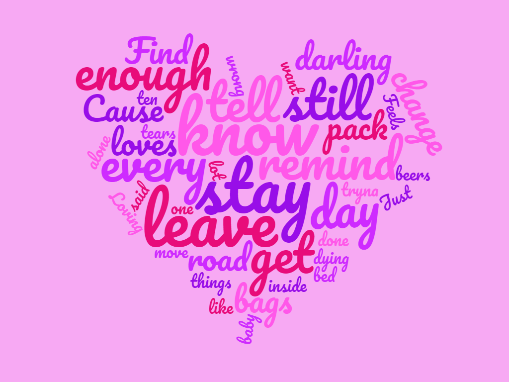

<!DOCTYPE html>
<html lang="en">
<head>

<meta charset="utf-8">
<meta name="viewport" content="width=device-width, initial-scale=1">

</head>
<body>

<header>
  <h2 style="border:2px solid purple;">July By Noah Cyrus</h2>
</header>

<section>
  <nav>
    <ul>
      <li><a href="lyrics.txt">Lyrics</a></li>
	   
      <li><a href="lyricsoutput.txt">Word Frequency</a></li>
	   
	  <li><a href="lyricsinfo.txt">Info</a></li>
    </ul>
  </nav>

  </article>
</section>

<footer>
  
Created by Melonie Aminov

  <p2>This webpage was developed for my data structures class in Brooklyn College.
      I have inserted a wordcloud made out of lyrics, attached the text
	  file with the lyrics, and included the word frequency list</p2>
</footer>

</body>
</html>

